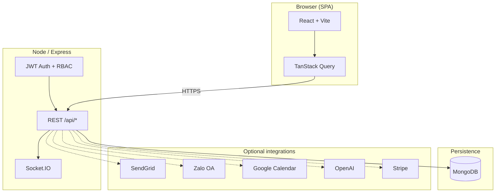
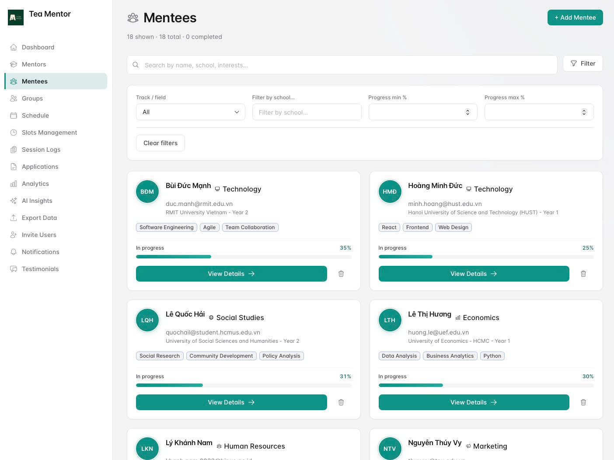
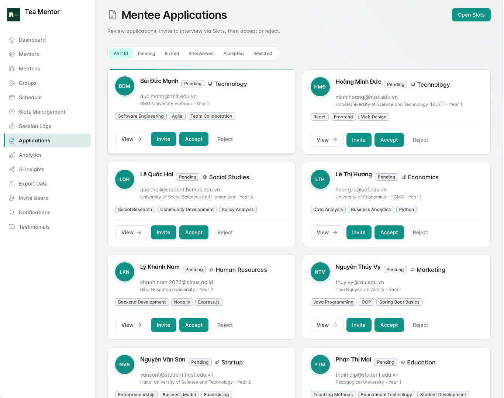
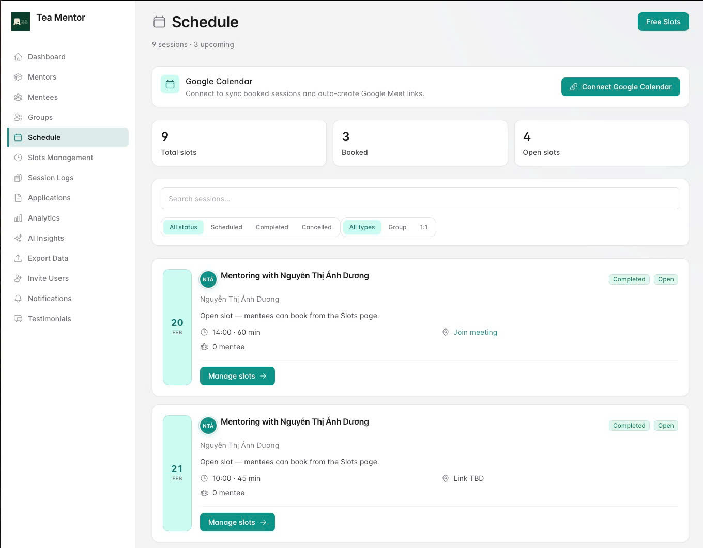
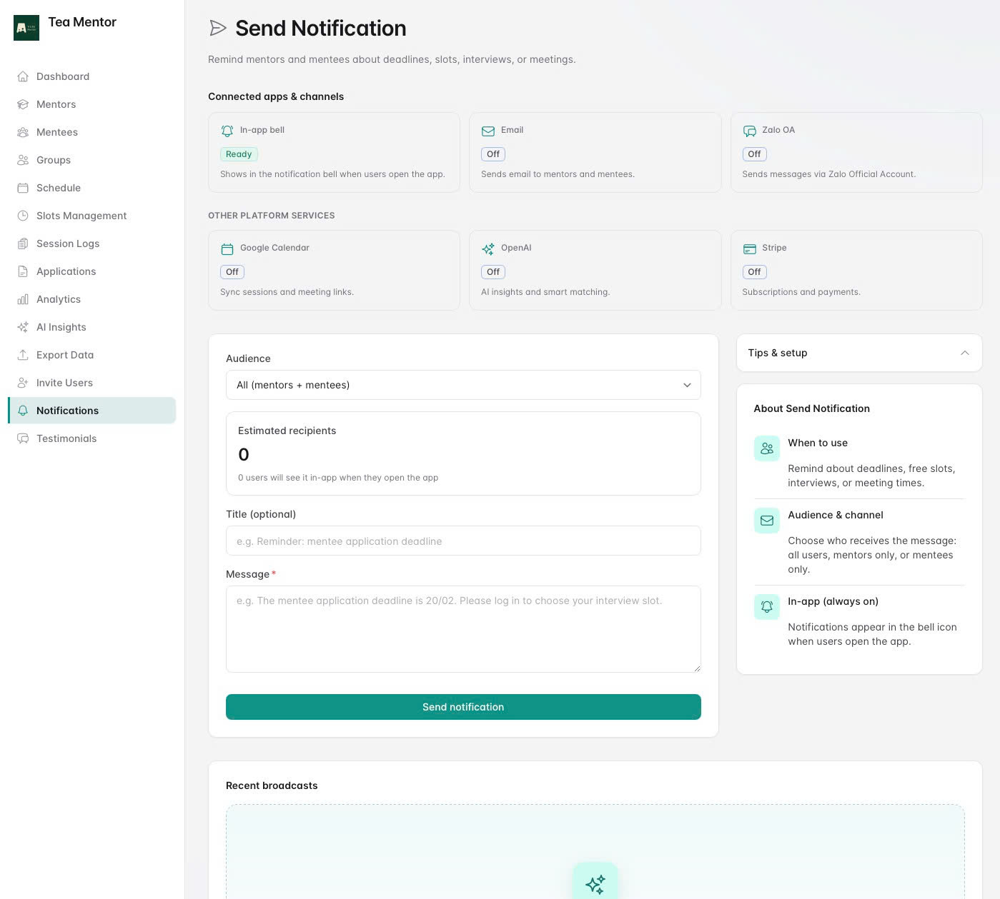

<p align="center">
  
</p>

<h1 align="center">Trà Đá Mentor Hub</h1>

<p align="center">
  <strong>Production-grade mentoring operations platform</strong><br />
  Mentor & mentee lifecycle · scheduling · session CRM · analytics · admin tooling
</p>

<p align="center">
  <a href="#overview">Overview</a> ·
  <a href="#architecture">Architecture</a> ·
  <a href="#product-screenshots">Screenshots</a> ·
  <a href="#getting-started">Getting Started</a> ·
  <a href="#development-workflow">Development</a> ·
  <a href="#quality-engineering">Quality</a> ·
  <a href="#deployment-runbook">Deployment</a> ·
  <a href="#security">Security</a>
</p>

<p align="center">
  
  
  
  
  
</p>

---

## Overview

**Trà Đá Mentor Hub** is a full-stack web application that operationalizes structured mentoring programs. It gives program administrators, mentors, and mentees a single system of record for profiles, cohorts, interview scheduling, post-session CRM, operational notifications, and program analytics.

### Problem statement

Mentoring programs typically fragment data across spreadsheets, chat threads, and ad-hoc calendars. That creates poor visibility, inconsistent follow-up, and high operational overhead.

### Solution

A unified platform with role-based access, persistent storage (MongoDB), real-time in-app notifications, and optional integrations (email, messaging, calendar, payments, AI) activated only when credentials are configured on the server.

### Personas & capabilities

| Persona | Primary capabilities |
|---------|----------------------|
| **Admin** | User invites, broadcast notifications, CSV export, testimonials, analytics, program configuration |
| **Mentor** | Profile management, availability slots, mentee visibility, session logging, schedule |
| **Mentee** | Application flow, slot booking, session participation, progress tracking |

### Technology stack

| Layer | Technologies |
|-------|----------------|
| **Client** | React 19, TypeScript, Vite, TanStack Query, React Router, Zod, i18next (EN · VI · JP · KR · CN) |
| **API** | Node.js 20+, Express 5, Mongoose, JWT access + refresh tokens, Socket.IO |
| **Data** | MongoDB (required in production) |
| **Integrations** *(optional)* | SendGrid, Zalo OA, Google Calendar, OpenAI, Stripe, Sentry |
| **Quality** | Jest, Vitest, Playwright, GitHub Actions |

---

## Architecture



### Design principles

1. **Single deployable unit** — The production server serves the built SPA and API from one process (suitable for Railway, Render, Docker).
2. **Fail-closed production** — Without MongoDB, the API refuses to start in `NODE_ENV=production` (no silent in-memory data loss).
3. **Secrets off the client** — Integration keys exist only in server environment variables; the admin UI shows service status, never credentials.
4. **Progressive enhancement** — In-app notifications work out of the box; email and Zalo activate when the operator configures them.

### Repository layout

```
Tra-Da-Mentor-Hub/
├── Images/                  # Product screenshots (documentation only)
├── backend/
│   ├── controllers/         # HTTP handlers
│   ├── models/              # Mongoose schemas
│   ├── routes/              # API routers
│   ├── services/            # Domain logic & stores
│   ├── middleware/          # Auth, rate limits, security
│   └── server.js            # Application entrypoint
├── src/                     # React application
│   ├── components/          # UI & feature modules
│   ├── pages/               # Route-level views
│   ├── hooks/queries/       # Server-state (React Query)
│   └── services/            # API client
├── e2e/                     # Playwright end-to-end specs
├── scripts/                 # Tooling (locales, admin bootstrap, env verify)
├── .github/workflows/       # CI pipeline
├── .env.example             # Documented environment template (safe to commit)
└── docker-compose.yml       # Local production simulation
```

---

## Product screenshots

All assets live under [`Images/`](./Images/). The product supports **light and dark** themes and **five UI locales**.

### Authentication

| Sign in (light) | Sign in (dark) |
|:--:|:--:|
|  |  |

| Registration (light) | Registration (dark) |
|:--:|:--:|
|  |  |

### Dashboard

| Program overview (light) | Activity & KPIs (light) |
|:--:|:--:|
|  |  |

| Program overview (dark) |
|:--:|
|  |

### Mentor & mentee management

| Mentor directory (light) | Mentor directory (dark) |
|:--:|:--:|
|  |  |

| Mentee directory | Create mentor | Create mentee |
|:--:|:--:|:--:|
|  |  |  |

| Edit mentor | Edit mentee | Mentee profile |
|:--:|:--:|:--:|
|  |  |  |

| Global quick search |
|:--:|
|  |

### Applications, schedule & slots

| Application pipeline | Master schedule | Available slots |
|:--:|:--:|:--:|
|  |  |  |

### Session CRM

| Post-session logs & support flags |
|:--:|
|  |

### Analytics & AI

| Analytics dashboard (light) | Analytics dashboard (dark) |
|:--:|:--:|
|  |  |

| Trend & engagement (light) | Trend & engagement (dark) |
|:--:|:--:|
|  |  |

| AI insights & smart matching |
|:--:|
|  |

### Testimonials

| Public testimonials | Admin curation |
|:--:|:--:|
|  |  |

### Admin operations

| Broadcast notifications | User invites | Data export |
|:--:|:--:|:--:|
|  |  |  |

---

## Getting started

### Prerequisites

| Requirement | Version |
|-------------|---------|
| Node.js | ≥ 20 |
| npm | ≥ 9 |
| MongoDB | 6+ (local or [Atlas](https://www.mongodb.com/atlas)) |

### 1. Clone and install

```bash
git clone https://github.com/TheHien04/Tra-Da-Mentor-Hub.git
cd Tra-Da-Mentor-Hub
npm install
```

### 2. Configure environment

```bash
cp .env.example .env
```

Edit `.env` locally. **Never commit this file.**

Minimum development configuration:

```env
NODE_ENV=development
PORT=5000
DATABASE_URL=mongodb://localhost:27017/tra-da-mentor

# Generate with: openssl rand -hex 64
JWT_SECRET=<64-char-hex>
JWT_REFRESH_SECRET=<different-64-char-hex>

CORS_ORIGIN=http://localhost:5173
FRONTEND_URL=http://localhost:5173
VITE_API_URL=http://localhost:5000/api
ENABLE_DEMO_AUTH=true
```

### 3. Run locally

```bash
# Terminal A — API :5000 + SPA :5173
npm run dev:all
```

Optional demo data:

```bash
npm run seed
```

**Demo credentials** (only when `ENABLE_DEMO_AUTH=true`):

| Field | Value |
|-------|-------|
| Email | `admin@example.com` |
| Password | `AdminPass123` |

### 4. Verify health

```bash
curl http://localhost:5000/api/health
```

---

## Development workflow

### NPM scripts

| Command | Purpose |
|---------|---------|
| `npm run dev` | Vite dev server (frontend only) |
| `npm run dev:server` | API with nodemon |
| `npm run dev:all` | Frontend + API concurrently |
| `npm run build` | Typecheck + production frontend build |
| `npm run start` | Production API (serves `dist/`) |
| `npm run start:prod` | `build` then `start` |
| `npm run lint` | ESLint |
| `npm run merge:locales` | Sync i18n keys from `en.json` |
| `npm run check:locales` | Enforce locale key parity |
| `npm run check:secrets` | Pre-push secret guard |
| `npm run verify:env` | Production env validation |
| `npm run create:admin` | Bootstrap first production admin |
| `npm run docker:up` | Docker Compose stack |

### Recommended local loop

1. Create a feature branch from `main`.
2. Implement with `npm run dev:all` running.
3. Run `npm run lint && npm run build` before opening a PR.
4. Run `npm run check:secrets` before pushing.

---

## Quality engineering

### Test pyramid

| Layer | Command | Scope |
|-------|---------|-------|
| **Unit + integration (API)** | `npm run test:unit` | All `backend/__tests__` (MongoDB required for auth suite) |
| **Coverage gate (CI)** | `npm run test:unit:ci` | Scoped backend modules + minimum thresholds |
| **Unit (UI)** | `npm run test:frontend` | Pure functions, form helpers |
| **E2E** | `npm run test:e2e` | Smoke, critical paths, production flows (Playwright) |
| **i18n** | `npm run check:locales` | Key parity across locale files |
| **API contract** | `npm run check:openapi` | Validates `docs/openapi.json` |

### Continuous integration

Every push/PR to `main`, `master`, or `develop` runs GitHub Actions:

- Dependency install (`npm ci`)
- Secret tracking guard (`check:secrets`)
- Typecheck + production build
- ESLint
- Unit tests (backend + frontend)
- Locale parity
- Production env script validation
- Playwright E2E (with MongoDB service)

See [`.github/workflows/ci.yml`](./.github/workflows/ci.yml).

---

## Deployment runbook

### Pre-release checklist

- [ ] `NODE_ENV=production`
- [ ] `ENABLE_DEMO_AUTH=false`
- [ ] MongoDB connection string set (`DATABASE_URL`)
- [ ] Strong, distinct `JWT_SECRET` and `JWT_REFRESH_SECRET` (≥ 64 hex chars each)
- [ ] `CORS_ORIGIN` restricted to production frontend origin
- [ ] `npm run verify:env` passes in CI or locally with production vars
- [ ] `npm run build` succeeds
- [ ] First admin created:  
  `npm run create:admin -- admin@company.com "Admin Name" 'StrongPass123!'`
- [ ] Persistent volume mounted at `backend/uploads` (avatars)
- [ ] HTTPS terminated at load balancer / platform edge
- [ ] Optional: `SENTRY_DSN` + `VITE_SENTRY_DSN` for error monitoring

### Docker (local production simulation)

```bash
npm run docker:up
# App → http://localhost:5000
```

`docker-compose.yml` provisions MongoDB and an `uploads` volume for avatar persistence.

### Platform deploy

For Railway, Render, or similar PaaS workflows, see **[DEPLOY.md](./DEPLOY.md)**.

---

## Security

### Secret management policy

| **Never commit** | **Safe to commit** |
|------------------|-------------------|
| `.env`, `.env.local`, any file with live credentials | `.env.example` |
| `deploy/*.generated`, platform env exports | `deploy/*.template` |
| `*.pem`, `credentials.json`, service account JSON | Application source code |
| User-uploaded avatars (`backend/uploads/*`) | `backend/uploads/avatars/.gitkeep` |

Enforced via `.gitignore` and `npm run check:secrets`.

### Application controls

- Bcrypt password hashing
- JWT access tokens + rotating refresh tokens
- Role-based route protection (admin / mentor / mentee)
- Helmet security headers, CORS allowlist, rate limiting
- Zod request validation
- Invite-token gated admin registration
- Production boot guard: MongoDB required; demo auth disabled by default

### Operator responsibilities

- Rotate JWT secrets if compromise is suspected
- Scope `CORS_ORIGIN` to known domains only
- Store SendGrid, Stripe, Google, and OpenAI keys in the hosting provider’s secret manager—not in the repository
- Review dependency updates regularly (`npm audit`)

---

## Documentation index

| Document | Purpose |
|----------|---------|
| [docs/ARCHITECTURE.md](./docs/ARCHITECTURE.md) | System design, layers, flows |
| [docs/openapi.json](./docs/openapi.json) | OpenAPI 3 contract |
| Interactive docs | `GET /api/docs` (Swagger UI when server is running) |
| [docs/adr/](./docs/adr/) | Architecture Decision Records |
| [docs/STAGING.md](./docs/STAGING.md) | Staging environment guide |
| [docs/RUNBOOK.md](./docs/RUNBOOK.md) | Operations & incident response |
| [CONTRIBUTING.md](./CONTRIBUTING.md) | Contributor workflow |
| [CHANGELOG.md](./CHANGELOG.md) | Version history |
| [DEPLOY.md](./DEPLOY.md) | Platform deployment |
| [PRODUCTION_READINESS.md](./PRODUCTION_READINESS.md) | Launch checklist |

## API reference (summary)

**Base URL:** `/api`  
**Authentication:** `Authorization: Bearer <accessToken>`  
**Full contract:** [docs/openapi.json](./docs/openapi.json) · live explorer at `/api/docs`

| Domain | Endpoints |
|--------|-----------|
| **Health** | `GET /api/health` |
| **Auth** | `POST /api/auth/login`, `register`, `refresh`, `logout` · `GET /api/auth/profile` · Google OAuth |
| **Mentors** | `GET/POST /api/mentors` · `GET/PATCH/DELETE /api/mentors/:id` |
| **Mentees** | `GET/POST /api/mentees` · `PATCH /api/mentees/:id/application-status` |
| **Groups** | `GET/POST /api/groups` · member assignment routes |
| **Operations** | `/api/slots`, `/api/session-logs`, `/api/activities` |
| **Admin** | `POST /api/admin/broadcast` · `/api/invites` · `GET /api/analytics/summary` |
| **Uploads** | `POST /api/uploads/avatar` |

---

## Feature catalog

| Module | Description |
|--------|-------------|
| **Auth & RBAC** | Email/password, Google SSO, invite-based registration, JWT refresh |
| **Mentor / Mentee CRM** | Profiles, tracks, avatars, search, detail views |
| **Groups** | Cohort management and mentee assignment |
| **Applications** | Pipeline status for mentee onboarding |
| **Scheduling** | Calendar-style schedule and interview slot booking |
| **Session logs** | Post-session notes, scores, support escalation flags |
| **Notifications** | In-app broadcast; optional email (SendGrid) and Zalo OA |
| **Invites** | Admin-issued registration links with MongoDB persistence |
| **Analytics** | KPI cards, engagement trends, exportable insights |
| **AI** | Smart match suggestions and insights (OpenAI, optional) |
| **Testimonials** | Curated success stories |
| **Export** | CSV export for mentors, mentees, session logs |
| **i18n & a11y** | Five languages, skip links, keyboard-friendly UI |

---

## Contributing

1. Fork the repository and create a branch from `main`.
2. Follow existing code style (TypeScript strict mode, ESLint).
3. Add or update tests for behavioral changes.
4. Run the full local quality gate before submitting a PR.
5. Do not include secrets, personal data, or production screenshots with PII.

---

## License

Released under the [MIT License](./LICENSE).

---

## Maintainers

**Trà Đá Community** · [TheHien04](https://github.com/TheHien04)

<p align="center">
  <sub>Built for mentoring programs that need operational rigor without operational chaos.</sub>
</p>
