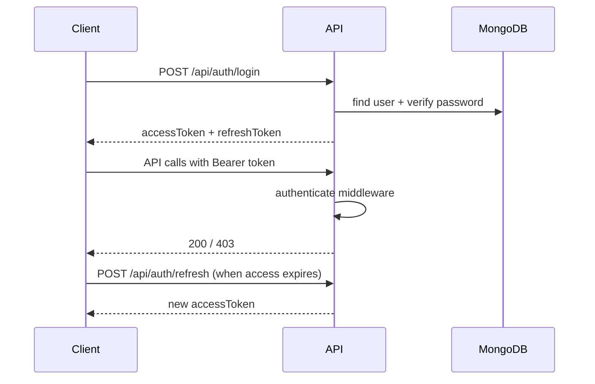

# Architecture — Trà Đá Mentor Hub

## System context

```mermaid
C4Context
  title System Context
  Person(admin, "Program Admin")
  Person(mentor, "Mentor")
  Person(mentee, "Mentee")
  System(hub, "Trà Đá Mentor Hub")
  System_Ext(mongo, "MongoDB")
  System_Ext(sendgrid, "SendGrid")
  System_Ext(zalo, "Zalo OA")
  System_Ext(google, "Google OAuth / Calendar")
  System_Ext(stripe, "Stripe")
  System_Ext(openai, "OpenAI")

  admin --> hub
  mentor --> hub
  mentee --> hub
  hub --> mongo
  hub -.-> sendgrid
  hub -.-> zalo
  hub -.-> google
  hub -.-> stripe
  hub -.-> openai
```

## Container view

| Container | Responsibility |
|-----------|----------------|
| **React SPA** | UI, client validation (Zod), server state (TanStack Query), i18n |
| **Express API** | REST `/api/*`, auth, business rules, file uploads |
| **Socket.IO** | Real-time notification delivery |
| **MongoDB** | System of record (users, profiles, slots, logs, invites) |

Production deploys the SPA static assets from the same Node process as the API (`backend/lib/serveFrontend.js`).

## Layering (backend)

```
HTTP Request
    → middleware (security, auth, rate limit)
    → routes (thin)
    → controllers (HTTP mapping)
    → services / stores (domain + persistence)
    → models (Mongoose schemas)
```

**Rules**

- Routes do not access Mongoose directly except for trivial cases being refactored.
- Secrets never leave `backend/config/env.js` consumers on the server.
- Production **must** connect to MongoDB before accepting traffic (`server.js` bootstrap).

## Layering (frontend)

```
Route (pages)
    → feature components
    → hooks/queries (React Query)
    → services/api.ts (Axios)
```

Shared UI primitives live under `src/components/ui/`.

## Authentication flow



See [ADR 002](./adr/002-jwt-rbac.md).

## Notification broadcast flow

1. Admin submits broadcast → `POST /api/admin/broadcast`
2. Always persists in-app notification (+ Socket.IO fan-out when connected)
3. Optionally sends email (SendGrid) and/or Zalo if channel selected **and** integration configured

See [ADR 003](./adr/003-in-app-notifications-first.md).

## Data domains

| Collection / store | Entities |
|--------------------|----------|
| Users | Auth identity, role |
| MentorProfile / MenteeProfile | Program participants |
| Groups | Cohorts |
| Slots | Interview availability |
| SessionLogs | Post-session CRM |
| Invites | Registration tokens |
| Notifications | In-app messages |

## Cross-cutting concerns

| Concern | Implementation |
|---------|----------------|
| Logging | Winston + HTTP request logger |
| Errors | Central `errorHandler` middleware |
| Validation | Zod (API + client) |
| i18n | i18next, `en` source + merged locales |
| Monitoring | Sentry (optional DSN) |
| Health | `GET /api/health` — 503 when Mongo required but down |

## API contract

Machine-readable spec: [`docs/openapi.json`](./openapi.json)  
Interactive UI: `GET /api/docs` when the server is running.

## Related documents

- [ADR 001 — MongoDB required in production](./adr/001-mongodb-required-production.md)
- [ADR 002 — JWT + RBAC](./adr/002-jwt-rbac.md)
- [ADR 003 — In-app notifications first](./adr/003-in-app-notifications-first.md)
- [Staging environments](./STAGING.md)
- [Operations runbook](./RUNBOOK.md)
